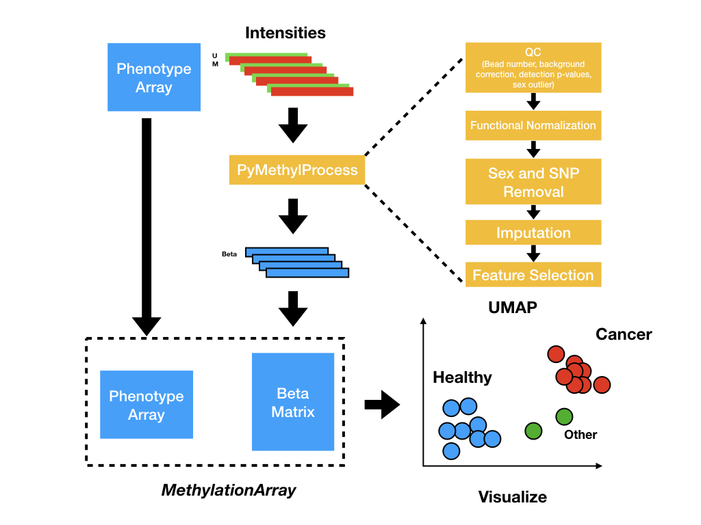
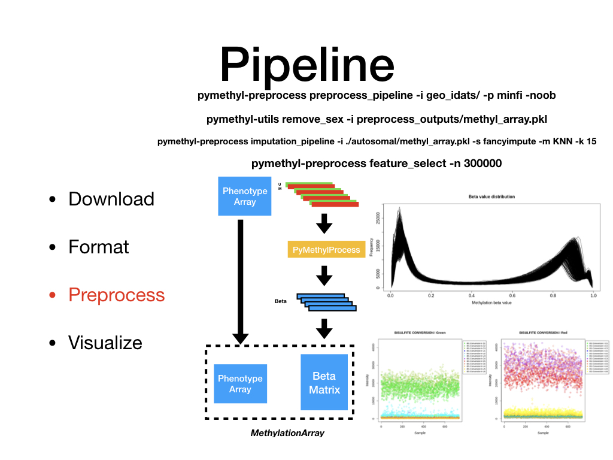

.. PyMethylProcess documentation master file, created by
   sphinx-quickstart on Sun Mar 10 15:59:43 2019.
   You can adapt this file completely to your liking, but it should at least
   contain the root `toctree` directive.

Welcome to PyMethylProcess's documentation!
===========================================

.. toctree::
   :maxdepth: 2
   :caption: Contents:

.. toctree::
   :maxdepth: 2
   :caption: Contents:

.. image:: _images/pipeline-download.jpeg
   :width: 800px
   :height: 600px
   :scale: 60%
   :alt: Download
   :align: center

.. image:: _images/pipeline-format.jpeg
   :width: 800px
   :height: 600px
   :scale: 60%
   :alt: Format
   :align: center

.. image:: _images/pipeline-visualize.jpeg
   :width: 800px
   :height: 600px
   :scale: 60%
   :alt: Visualize
   :align: center

.. image:: _images/pipeline-train-test-split.jpeg
   :width: 800px
   :height: 600px
   :scale: 60%
   :alt: TrainTestSplit
   :align: center

.. argparse::
   :module: pymethylprocess.basic_installer
   :func: main
   :prog: pymethyl-basic-install

.. click:: pymethylprocess.installer:install
   :prog: pymethyl-install
   :show-nested:

.. click:: pymethylprocess.visualizations:visualize
   :prog: pymethyl-visualize
   :show-nested:

.. click:: pymethylprocess.preprocess:preprocess
   :prog: pymethyl-preprocess
   :show-nested:

.. click:: pymethylprocess.utils:util
   :prog: pymethyl-utils
   :show-nested:

.. argparse::
   :module: pymethylprocess.run_random_forest
   :func: main
   :prog: pymethyl-basic-ml

Indices and tables
==================

* :ref:`genindex`
* :ref:`modindex`
* :ref:`search`
