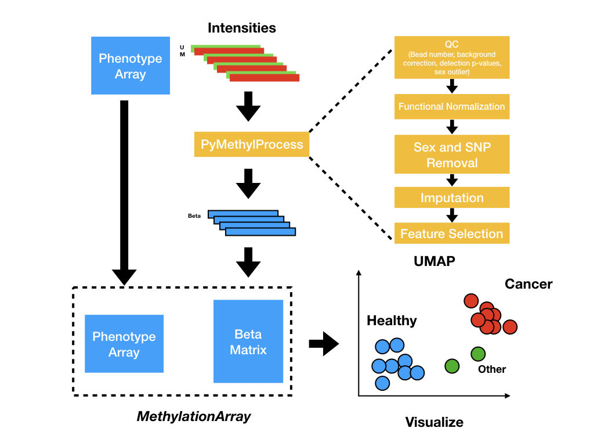
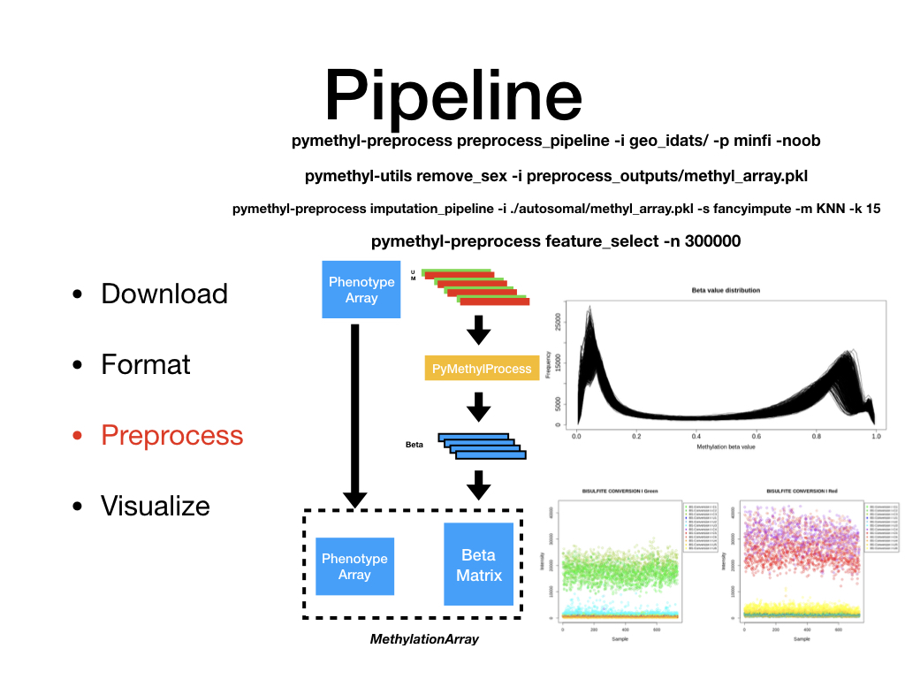
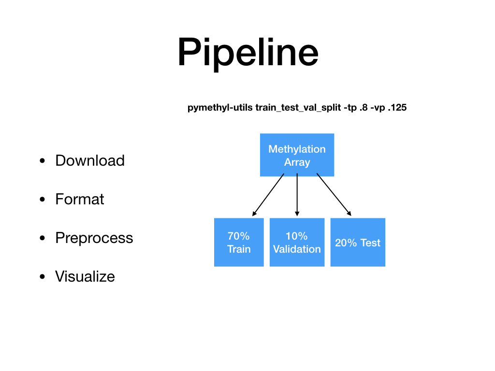

## PyMethylProcess

https://github.com/Christensen-Lab-Dartmouth/PyMethylProcess  

What is it:
* Preprocess 450k and 850k methylation IDAT files in parallel using Minfi, ENmix, and meffil  
* Convenient and scalable implementation  
* Imputation and Feature Selection  
* Preparation for machine learning pipelines    

Why:
* Make DNAm accessible to python developers and more machine learning oriented researchers  
* Streamlined analysis makes processing easy  

Getting Started:  
* Installation:    
    * pip install pymethylprocess && pymethyl-install_r_dependencies  
    * docker pull joshualevy44/pymethylprocess  
    * Or see example scripts for usage, install from github
* Example Usage Scripts (in github repo): Located in ./example_scripts/  
* Help docs (in github repo): ./Docs/build/html/index.html (to be updated; also will be hosted soon)

*PyMethyProcess* is pending submission and review, and link to paper will be posted shortly.

Note: May need to prefix pip install with MACOSX_DEPLOYMENT_TARGET=10.9 CC=clang CXX=clang++ for Mac OS install

# todo: add images, add other two CLI, fix general machine learning, document all classes, publish and reference published help docs in readme
